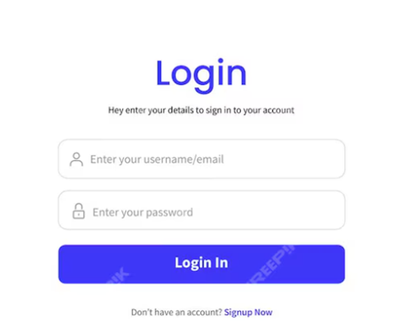
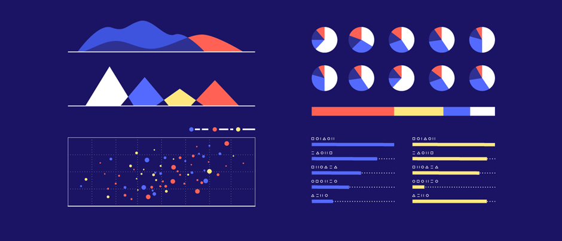
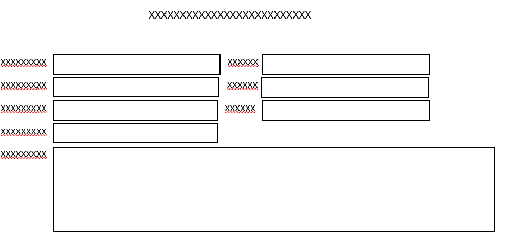
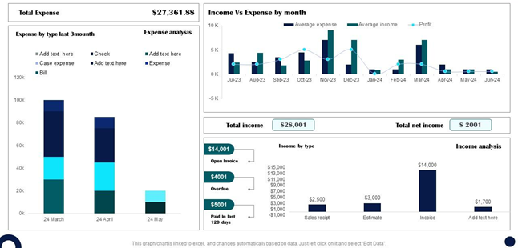

# Project phase 1 - Definition and planning 
#### **1. User Personas**  
To better understand the target audience, we define two key user personas:
1. **Young Professional**  
   - **Age:** 25–35  
   - **Goals:** Wants to track daily expenses and save for future goals.  
   - **Pain Points:** Finds it challenging to manually record expenses and wishes to get insights on spending habits.  

2. **Family Budget Planner**  
   - **Age:** 35–50  
   - **Goals:** Manages household expenses and aims to stay within monthly budgets.  
   - **Pain Points:** Struggles with organizing expenses across multiple family members efficiently.

---

#### **2. Use Cases and User Flows**  
**Use Cases:**  
1. **Adding an Expense:**  
   - User inputs expense details such as amount, date, category, and description.  
   - Application saves the expense and updates the overall summary.  
   
2. **Viewing Expense Summary:**  
   - User opens the dashboard to view a visual representation (charts/graphs) of monthly spending patterns.  

3. **Setting Budget and Notifications:**  
   - User sets a monthly spending limit.  
   - Application monitors expenses and sends alerts when the limit is approached or exceeded.  
4. **Deleting:**  
   - Delete some unnecessary item if plan change.

**User Flow Example:**  
- **Flow 1:**  
  1. User logs in to the system.  
  2. Navigates to the dashboard.  
  3. Clicks “Add Expense” to input data.  
  4. Data updates dynamically, and the user sees an updated summary.  

---

#### **3. UI Prototypes**  
The main interface includes:  
1. **Login/Sign-up Page:**  
   - Minimalistic design ensuring easy user access.  

   

2. **Dashboard:**  
   - Contains visual representations (e.g., pie charts, bar graphs) and expense summaries. 

3. **Expense Entry Form:**  
   - Includes fields for amount, date, category, and description with dropdown menus for category selection.  

   

4. **Reports Page:**  
   - Allows users to view detailed expense reports, filter by date, and export data in PDF/Excel formats. 
    

Tools for UI Prototyping: **Figma**.  

---

#### **4. Information Architecture and Technical Design**  
**Information Architecture:**  
- **Database Schema:**  
  - **Users:** UserID, Name, Email, Password.  
  - **Expenses:** ExpenseID, UserID, Amount, Date, Category, Description.  

**Navigation Map:**  
1. **Login/Sign-up → Dashboard → Add Expense → Reports**  

**Technical Design:**  
1. **Frontend:** Built using **React** with libraries such as **Material-UI** or **TailwindCSS**.  
2. **Backend:** Developed with **Node.js** and **Express.js**.  
3. **Database:** **MongoDB** for storing user profiles and expenses.  
4. **API Design:**  
   - `POST /expenses` for adding new expenses.  
   - `GET /expenses` for retrieving expense data.  
   - `DELETE /expenses/:id` for deleting specific expenses.  

---

#### **5. Project Management and User Testing**  
**Project Management:**  
- Use tools like **Trello** or **Jira** to organize tasks.  
- Milestones:
  - Week 1: Complete definition and design.  
  - Week 2–4: Develop core functionalities (e.g., expense entry, dashboard).  
  - Week 5–6: Integrate advanced features (e.g., budget notifications, data export) and test functionality.  

**User Testing:**  
- Recruit 3 –5 testers to review usability.  
- Conduct testing of the dashboard, expense entry form, and reports page.  
- Use feedback to iterate and enhance the UI/UX design.

---
